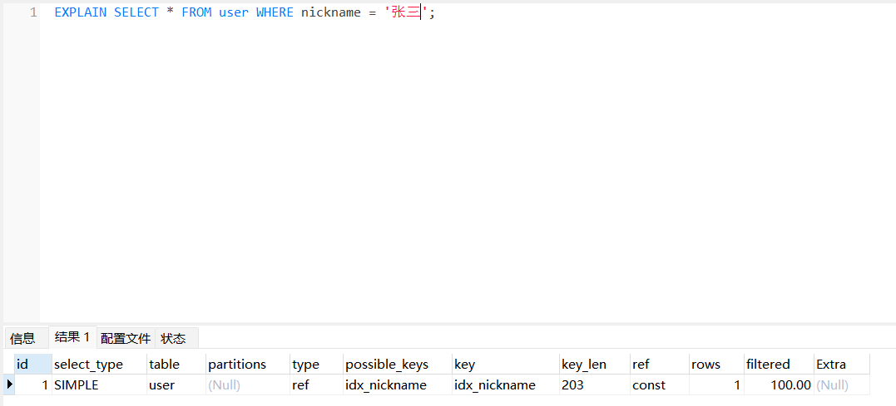
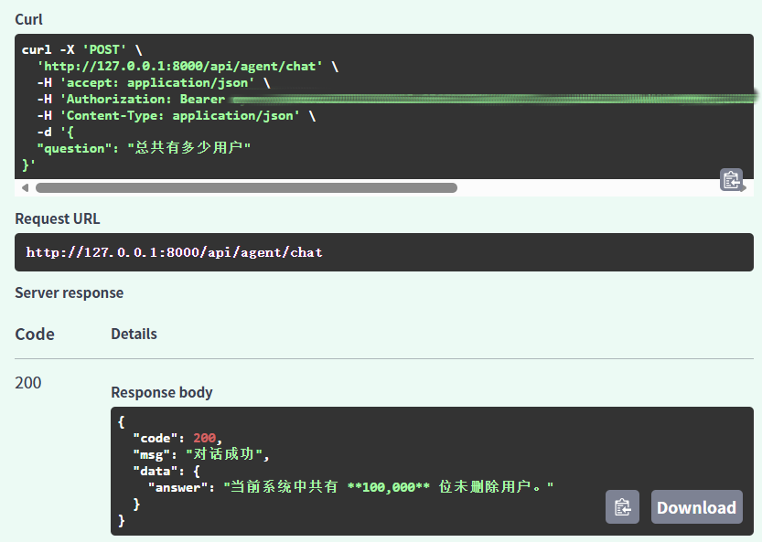

# ai-admin-fastapi (1.0)

> **一个修复了模糊查询失效与非法注册漏洞的企业级 FastAPI 后端脚手架。**

## 项目简介

基于 Python + FastAPI 构建的后端管理系统，采用标准三层架构，独立实现用户注册/登录、JWT 身份认证、用户信息增删改查（含软删除）、分页/模糊查询等核心功能。项目重点修复了模糊查询失效、非法用户注册等关键 Bug，并引入软删除机制保障数据可恢复性，通过索引优化提升查询性能，确保系统稳定性与数据安全性。已基于 LangChain 封装 Function Calling 工具集，实现自然语言驱动的业务数据查询能力。

## 技术栈

- **后端框架**：FastAPI
- **数据库**：MySQL 8.0+
- **ORM**：SQLAlchemy 2.0
- **身份认证**：PyJWT
- **数据校验**：Pydantic V2
- **开发语言**：Python 3.10+
- **AI工程**：LangChain · Function Calling · Agent 工具集

## 项目目录结构
```text
ai-admin-fastapi/
├── api/            # 接口控制层（user_router.py + agent_router.py）
├── service/        # 业务逻辑层（user_service.py + agent_service.py）
├── dao/            # 数据访问层
├── model/          # 数据模型
├── utils/          # 工具类
├── tools/          # Agent 工具集（Function Calling 工具注册表）
├── config/         # 项目配置
├── scripts/        # 测试与数据生成脚本
├── .env.example
├── README.md
└── requirements.txt
```
## 已实现功能

### 用户模块
- 用户注册接口（严格参数校验 + 自动清洗）
- 用户登录接口（JWT Token 生成与校验）
- 用户信息增删改查（软删除，is_deleted 标记，数据可恢复）
- 用户列表分页查询（自定义页码与每页条数）
- 用户信息模糊查询（支持任意位置匹配）

### AI Agent 模块
- Agent 对话接口（`POST /api/agent/chat`），支持自然语言驱动的业务数据查询
- 基于 LangChain 封装 Function Calling 工具集（用户总数查询、用户名模糊搜索）
- 内置调用超时捕获与入参合法性校验兜底逻辑

### 基础工程能力
- 标准三层架构（Controller/Service/DAO）
- 请求参数全链路校验（类型、长度、格式）
- 数据库 ORM 操作封装
- 全局异常统一处理 + 标准化返回格式
- 接口访问日志记录

## 核心问题解决与优化

### 1. 修复模糊查询完全失效
- **现象**：数据库存在匹配数据，但条件查询返回空列表。
- **解决方案**：  
  - 将 SQL 通配符改为 `%{username}%`，实现任意位置匹配。  
  - 增加严格空值/纯空格过滤（`if username is not None and username.strip() != ""`）。  
- **成果**：模糊查询准确率 100%，支持关键词任意位置匹配。

### 2. 修复非法用户注册的安全漏洞
- **现象**：空用户名、1位用户名、5位短密码可正常注册，产生脏数据。
- **解决方案**：  
  - 使用 Pydantic V2 的 `Field(min_length=, max_length=)` 限制用户名（2-32位）和密码（6-64位）。  
  - 修复自动去空格的兼容性问题（采用 `@field_validator(mode='before')`）。  
- **成果**：彻底杜绝非法注册，数据质量与系统安全性大幅提升。

### 3. 索引优化与软删除机制
- 为 username 字段创建索引，使用 EXPLAIN 分析执行计划，确认索引命中，避免全表扫描。
- 引入 is_deleted 字段实现软删除，查询接口自动过滤已删除用户，保障数据可追溯与审计。

### 4. AI 工程化落地
- 基于 LangChain 封装 Function Calling 工具集，将用户查询接口包装为大模型可自主调用的工具。
- 新增 `/api/agent/chat` 接口，支持自然语言驱动的业务数据查询，内置超时捕获与入参校验兜底逻辑。

## 后续计划（AI 模块）

- 扩展 Agent 工具集，支持更多业务接口（如用户信息修改、删除等操作）
- 探索 RAG 知识库问答模块，积累 AI 后端落地经验

## 项目启动

## 项目演示





### 安装依赖
```bash
pip install -r requirements.txt
```
配置环境变量
复制 .env.example 为 .env，填写本地数据库配置：
```env
DB_HOST=127.0.0.1
DB_PORT=3306
DB_USER=root
DB_PASSWORD=你的密码
DB_NAME=study
DB_CHARSET=utf8mb4
JWT_SECRET_KEY=你的密钥
JWT_EXPIRE_MINUTES=1440
```
启动项目
```bash
uvicorn main:app --reload
```
访问接口文档
启动成功后，浏览器打开：
```
http://127.0.0.1:8000/docs
```
注意事项
若提示 “URL 拼写错误”，请检查项目是否成功启动、端口是否被占用、浏览器地址是否正确（不要漏掉 /docs）。

Python 版本建议 3.10 以上。

## SQL 性能优化测试报告

### 测试环境与优化动作

本次测试基于 `user` 用户表，数据量为 **100,000** 条。优化动作为新增两个业务索引：

- `idx_nickname`：`nickname` 字段普通索引，用于加速昵称等值查询
- `uk_username`：`username` 字段唯一索引，符合用户名唯一性业务约束

测试采用项目内脚本 [`test_performance_before.py`](test_performance_before.py)（优化前基准）与 [`test_performance_with_index.py`](test_performance_with_index.py)（索引创建 + EXPLAIN 验证 + 优化后测试）执行。每类查询循环 5 次，去掉最高/最低值后取平均耗时（单位：ms）。

### 性能对比结果

| 查询场景 | SQL 语句 | 优化前 (ms) | 优化后 (ms) | 性能变化 |
|---------|---------|------------|------------|---------|
| 深分页查询 | `SELECT * FROM user LIMIT 10 OFFSET 50000` | 61.58 | 57.97 | +5.86% |
| 用户名前导模糊查询 | `SELECT * FROM user WHERE username LIKE '%test%'` | 93.05 | 145.89 | -56.79% |
| 昵称精确查询 | `SELECT * FROM user WHERE nickname = '张三'` | 96.77 | 0.91 | +99.06% |

> 性能变化比例 = (优化前 − 优化后) / 优化前 × 100%。正值表示耗时降低（性能提升），负值表示耗时增加（性能下降）。

### 分场景 EXPLAIN 原理分析

#### 1. 昵称精确查询（96.77 ms → 0.91 ms，提升 99.06%）

**优化前（全表扫描）**

- 无 `nickname` 索引时，`EXPLAIN` 执行计划通常为 `type=ALL`
- InnoDB 需顺序扫描约 10 万行数据，逐行比对 `nickname = '张三'` 条件
- 时间复杂度近似 O(n)，数据量越大耗时线性增长

**优化后（索引定位）**

- 创建 `idx_nickname` 后，`EXPLAIN` 显示 `type=ref`，`key=idx_nickname`
- B+ 树按 `nickname` 值有序存储，等值查询可直接定位目标节点，扫描行数从 ~100,000 降至个位数
- 随机 I/O 大幅减少，查询耗时从近百毫秒降至 1 ms 以内

**结论**：等值条件 + 高选择性字段 + 普通 B+ 树索引，是索引优化收益最显著的经典场景。

#### 2. 用户名前导模糊查询（93.05 ms → 145.89 ms，下降 56.79%）

**B+ 树索引无法匹配前导通配符**

- B+ 树索引按字段值字典序排列，等值或前缀匹配（如 `LIKE 'test%'`）可确定扫描起点
- 前导通配符 `LIKE '%test%'` 无法确定起始位置，优化器无法利用索引的有序性进行范围定位
- `EXPLAIN` 通常显示 `type=ALL` 或 `key=NULL`，表明索引未被有效使用

**加索引后反而变慢的原因**

- 新增 `uk_username` 后，优化器可能尝试索引扫描 + 回表（Index Scan + Table Lookup）
- 索引页与数据页分散存储，回表产生大量随机 I/O，开销高于顺序全表扫描
- 额外维护索引结构也增加了优化器选择低效执行计划的概率
- 综合结果：索引扫描 + 回表成本 > 全表顺序扫描，耗时从 93 ms 上升至 146 ms

**结论**：B+ 树索引不适用于前导 `%` 模糊查询。此类场景应避免依赖普通索引，可考虑 MySQL 全文索引（FULLTEXT）、Elasticsearch 等专用检索方案，或业务层限制为后缀匹配（`LIKE 'test%'`）。

#### 3. 深分页查询（61.58 ms → 57.97 ms，提升 5.86%）

**OFFSET 深分页的性能瓶颈**

- `LIMIT 10 OFFSET 50000` 的执行逻辑是：扫描并跳过前 50,000 行，再返回 10 行
- 即使存在主键或唯一索引，MySQL 仍需"数过"前 50,000 条记录，成本随 OFFSET 线性增长
- 本次优化前后差异仅约 6%，属于正常测试波动，不构成实质性优化

**普通索引对深分页优化有限的原因**

- 深分页的性能瓶颈在于"跳过大量行"，而非"定位单行"
- `username` 唯一索引可加速等值查询，但无法避免 OFFSET 带来的逐行跳过开销
- 除非改用覆盖索引 + 延迟关联等专项方案，否则单纯加索引对深分页帮助甚微

**推荐替代方案**

- **游标分页**：`SELECT * FROM user WHERE id > :last_id ORDER BY id LIMIT 10`，利用主键有序性避免大 OFFSET
- **延迟关联**：子查询先通过覆盖索引取出 id，再 JOIN 回主表取完整行，减少回表数据量

### 结论与最佳实践

| 场景 | 索引是否有效 | 建议 |
|------|------------|------|
| 等值查询（`nickname = ?`） | 有效，收益显著 | 为高频过滤字段建立普通索引 |
| 唯一约束（`username = ?`） | 有效 | 使用唯一索引，兼顾约束与查询加速 |
| 前导 `%` 模糊查询 | 无效甚至负优化 | 避免依赖 B+ 树索引，考虑全文检索或搜索引擎 |
| OFFSET 深分页 | 优化有限 | 改用游标分页或延迟关联 |

本次实测验证了"索引并非银弹"：索引设计应结合具体查询模式与 EXPLAIN 执行计划分析，针对高频、高选择性的等值查询建立索引，对模糊检索和深分页则需采用专项优化策略，而非盲目加索引。
